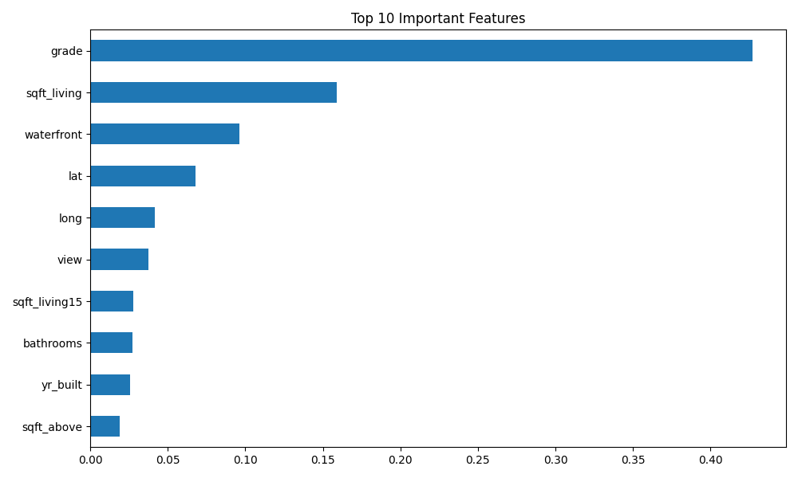

# 🏠 House Price Prediction – Advanced Machine Learning Regression Pipeline


---

# 📌 Project Overview

This project builds an **end-to-end machine learning pipeline** to predict **house prices** using property-related features.

The pipeline includes:

• Data preprocessing
• Exploratory Data Analysis (EDA)
• Feature engineering
• Model training and comparison
• Hyperparameter tuning
• Model evaluation
• Feature importance visualization

The goal is to create a **robust regression model capable of accurately predicting housing prices**.

---

# 🎯 Problem Statement

Accurate house price prediction is crucial for:

* Real estate investors
* Home buyers
* Property valuation systems
* Real estate analytics platforms

This project aims to build a **machine learning regression pipeline** that predicts housing prices based on property characteristics.

---

# 📊 Dataset

The dataset contains housing features such as:

* Area / square footage
* Number of bedrooms
* Number of bathrooms
* Floors
* Waterfront property
* Condition and grade
* Location related attributes
* House age

Target variable:

```
price
```

---

# 🛠 Technologies Used

* Python
* Pandas
* NumPy
* Scikit-Learn
* XGBoost
* Matplotlib
* Seaborn
* Joblib

---

# 📂 Project Structure

```
house-price-prediction/

│
├── data/                      # Dataset folder (housing.csv)
│
├── models/                    # Saved trained models
│   ├── best_house_price_model.pkl
│   └── tuned_house_price_model.pkl
│
├── outputs/                   # Visual outputs
│   └── feature_importance.png
│
├── notebooks/                 # Exploratory analysis
│   └── eda.ipynb
│
├── src/                       # Source code
│   ├── data_preprocessing.py
│   ├── train_model.py
│   └── evaluate_model.py
│
├── requirements.txt           # Project dependencies
└── README.md                  # Project documentation
```

---

# 🔎 Exploratory Data Analysis

The EDA notebook includes:

* Data inspection
* Missing value analysis
* Statistical summary
* Feature correlation analysis
* Price distribution visualization
* Correlation heatmap

---

# 🤖 Machine Learning Models

Three regression models were trained and compared:

### 1️⃣ Linear Regression

Baseline regression model.

### 2️⃣ Random Forest Regressor

Handles nonlinear relationships and feature interactions.

### 3️⃣ XGBoost Regressor

Gradient boosting model providing the best performance.

---

# 📈 Model Evaluation Metrics

The models were evaluated using:

* **R² Score**
* **Mean Absolute Error (MAE)**
* **Root Mean Squared Error (RMSE)**

These metrics help measure the accuracy and error of price predictions.

---

# 🏆 Best Model

The **XGBoost Regressor** achieved the best performance.

Example evaluation:

```
R² Score : 0.87
MAE      : ~70,000
RMSE     : ~136,000
```

---

# 📊 Feature Importance

The trained model generates a **feature importance visualization** showing the most influential housing features affecting price predictions.

The model identifies the most influential features affecting house prices.


```

---

# ⚙️ Installation

Clone the repository:

```
git clone https://github.com/YOUR_USERNAME/house-price-prediction.git
cd house-price-prediction
```

Install dependencies:

```
pip install -r requirements.txt
```

---

# ▶️ Running the Project

Train the models:

```
python src/train_model.py
```

Evaluate the model:

```
python src/evaluate_model.py
```

---

# 🚀 Future Improvements

* Advanced feature engineering
* Hyperparameter optimization using GridSearch / Optuna
* Deployment using Flask / FastAPI
* Model monitoring pipeline
* Docker containerization

---

# 👨‍💻 Author

**Bhushan Patil**

AI / Machine Learning Engineer
Pune, Maharashtra, INDIA